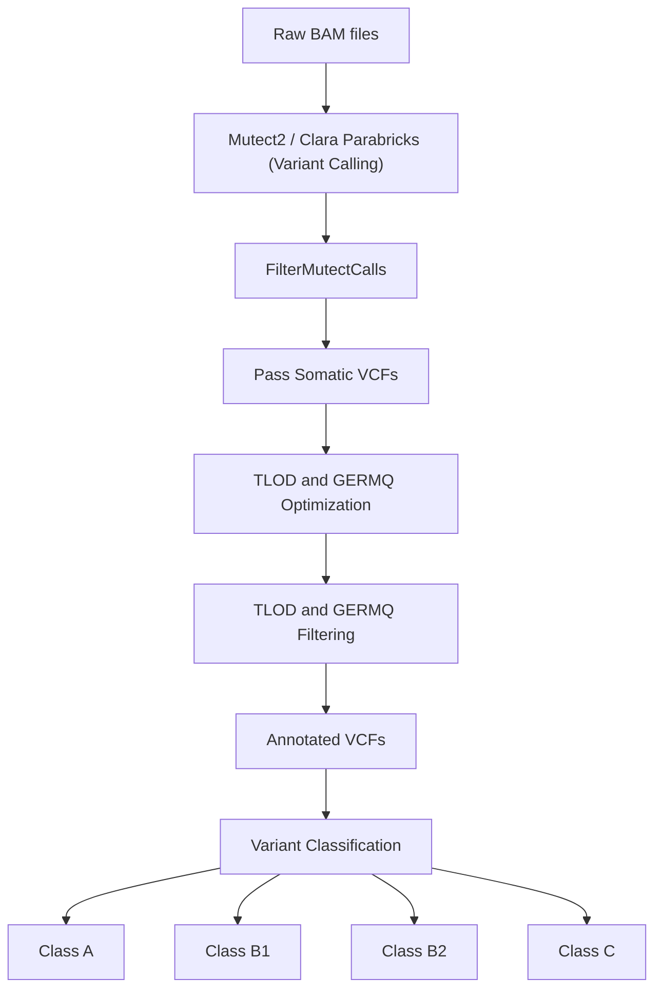

**cfDNA Somatic Variant Analysis Pipeline**
**Overview**
This repository contains scripts used for somatic variant calling, post-filtering, and variant classification in cfDNA whole-genome sequencing analysis.

The workflow includes:
    1. Somatic variant calling using Mutect2/Parabricks
    2. Tumor-only and tumor-normal comparison
    3. TLOD and GERMQ-based post filtering 
    4. Annotation by Ensembl-VEP and PanDrugs
    5. Classification (supported by COSMIC and Ensembl prediction tools)
This script provided in this repository are minimally modified versions of the original execution script used in this study. Sample identifiers and file paths have been anonymized while preserving the original computational workflow.

**Workflow overview**


**Repository Structure**
```text
Script_cfDNA_somatic_variant_analysis/
│
├── 01_Variant_calling/
│   ├── Tumor-normal-mode/
│   └── Tumor-only-mode/
│
├── 02_Variant_filtration/
│   ├── Example/
│   ├── sweep_TLOD.py
│   ├── sweep_GERMQ_per_sample.py
│   ├── filter_TLOD_GERMQ.py
│   └── README.md
│
├── 03_Classification/
│   ├── classify_variants.py
│   ├── 1_RUN_classify_variants.sh
│   └── README.md
│
└── README.md
```

**Requirements**
    1.Linux environment
    2.SLURM workload manager
    3.Python 3.12+
    4.GATK 4.6+
    5.NVIDIA Parabricks
    6.Ensembl VEP-annotated VCFs

**NOTES**
-All sample identifiers shown are anonymized placeholders.
-File paths are generalized for reproducibility purposes.
-Original computational logic was preserved.
